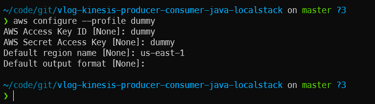

## Start LocalStack

Start localstack
```sh
docker compose -f localstack.yml up
```

## Environment variables

Kinesis Producer

```properties
KINESIS_CUSTOM_ENDPOINT_HOST=localhost;
KINESIS_CUSTOM_ENDPOINT_PORT=4566;
KINESIS_STREAM_NAME=therdnotes-delivery-stream;
KINESIS_STREAM_REGION=us-east-1
```

Kinesis Consumer

```properties
KINESIS_STREAM_NAME=therdnotes-delivery-stream;
KINESIS_STREAM_REGION=us-east-1;
KINESIS_CUSTOM_ENDPOINT=http://localhost:4566
```

---

## `awsls` script
This script helps to bypass mentioning the custom endpoint with every AWS CLI command. Also I am using a dummy profile so that I dont pass my authentic credentials to the localstack.

#1 Setup dummy profile



#2 Make it executable and try it
```sh
chmod +x ./awsls.sh
./awsls.sh kinesis list-streams
```